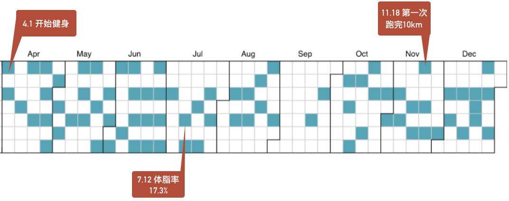
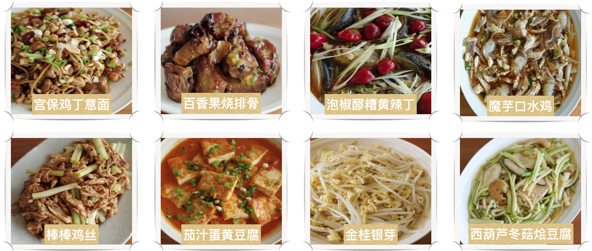
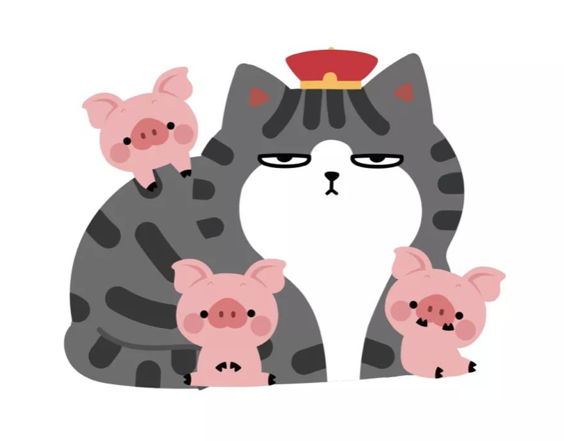

# 我的2018年总结

---

其实元旦前就写了一些，然后反复思考了一段时间，但还是想在农历年前用文字的方式总结一下我的2018。有些话不说出来，害怕自己在一天天的日子里忘记了最初的想法，也没有毅力能真正坚持下去。

**2018年的主题是拥抱变化，努力成长。**

---

毕业工作满一年多了，这一年也经历了内心很大的起起伏伏，身边的人走走停停，而自己也好像兜了一圈又回到了原地。有过深夜加班的无奈，有过压力过大的流泪，有过迷茫的纠结，也有过对于伙伴离开的深深不舍……在各种动荡中，我寻找着自己的位置，思考着未来的路应该如何走，我应该成为怎样的自己。也许，这些都很难找到答案。

这一年在工作中最大的收获有两点：**学会总结授之于人、积极探索。**

总结了很多行业上的内容给同伴们，努力成为一个输出者。这不仅惠及同伴，对于自己也是一种提升。输出让我更深地去理解事物的底层本质，也让我更有条理地归纳方法论。当然，其中也有我心态上的一种转变：从"我需要做些什么"到"我可以为团队做些什么"。视角和角色在内心也都有了一些转变。

虽然自认为不是一个具有创新性的人，但在日常工作之余也开始进行了一些探索，希望真的能做出些什么。入数据这一行，更多的还是希望自己能成为一个解决问题的人，或许不应该太被工作职能所局限。去舒适圈外走走，才可能有跨越式成长。

---

每年回顾自己的阅读情况时，总是会很惭愧，开卷的很多，但能读完的却寥寥。2018年我一共读完了24本书，但一半左右都是小说，然后就是一些传记、心理学、工作相关的书。信息过载的当下，似乎很难静下心来看一本书；而阅读的内容也变得越来越功利或娱乐。今年的目标是能读完30本书左右，小说少一点，其他方面多涉猎一些。

晚上回到家，打开视频网站后，又默默地关掉窗口，打开台灯，泡一杯好茶，读一本书，也许别有一番风味。

---

这一年最满意的就是将健身坚持了下来。4月开始后，基本上每周两次，风雨无阻。

最初，健身只是为了减肚肚上的肉，想要变得更瘦；锻炼下来，发现自己其实体脂并不高，也慢慢学会了放弃对于体重的执念（如果3位数的体重看起来像2位数也没什么不好😝）。中间一度体脂很低，失去了健身的目标，但自己却慢慢习惯了这种生活方式，也不像刚开始去健身那会儿，需要努力做自我内心建设了。每天在电脑桌前的工作时间总是那么长，健身对我而言一个是活动活动筋骨，另外也是让我在繁忙之余有这样一段时间可以专注去锻炼身体，忘却其他的烦恼。

2019年健身还是要继续下去，对自己的期望就是能循序渐进地慢慢自己锻炼，对于每个动作能知其然也能知其所以然吧，当然马甲线还是要有的~😝

---

毕业一年多，进步最大在生活中显而易见的还是厨艺。从最初的怕油溅、切土豆丝要切10来分钟，到如今能好好地做出一桌菜，自己还是很欣喜于这样的蜕变。甜点、意面、家常菜……跟着书本和喜欢的博主尝试了很多的菜肴，周末总要下厨给自己做些好吃的。😋

今年有一个小小的目标，是希望能慢慢戒掉重口味。虽然现在已经好多了，不再每顿都要吃辣椒，但还是会向往臭豆腐、小龙虾以及红汤火锅的滋味。对于无辣不欢的湖南人，这确实是个挑战，毕竟之前对于清淡的菜肴我是不屑一顾的。想做出这个变化，一个是健身确实应该配合着健康的饮食才能事半功倍，另外也是想让自己能体验到食物本身的鲜味和层次感（对重口的眷念总是会让自己放纵）。当然，是不是也该养生了。🤔

---

每年的总结都是对自己的一次回顾，在年岁渐长中，我想成为怎样的我，我最终会成为怎样的我，这也许需要用这辈子来寻找答案。

---

**2019年，我给自己的关键词是：自律、突破、接纳**    

自律：想要做的很多，但真正能做完做好的却只有那几个；希望自己能成为自己时间的掌控者，不要浪费光阴；

突破：很想改变自己不自信的一面，在彷徨犹豫时提醒自己向前一步，不给自己设限，就会不断给自己带来新的惊喜；

接纳：改变能改变的，然后接纳不完美的自己，学会和解。

2019，"猪"事顺利~

